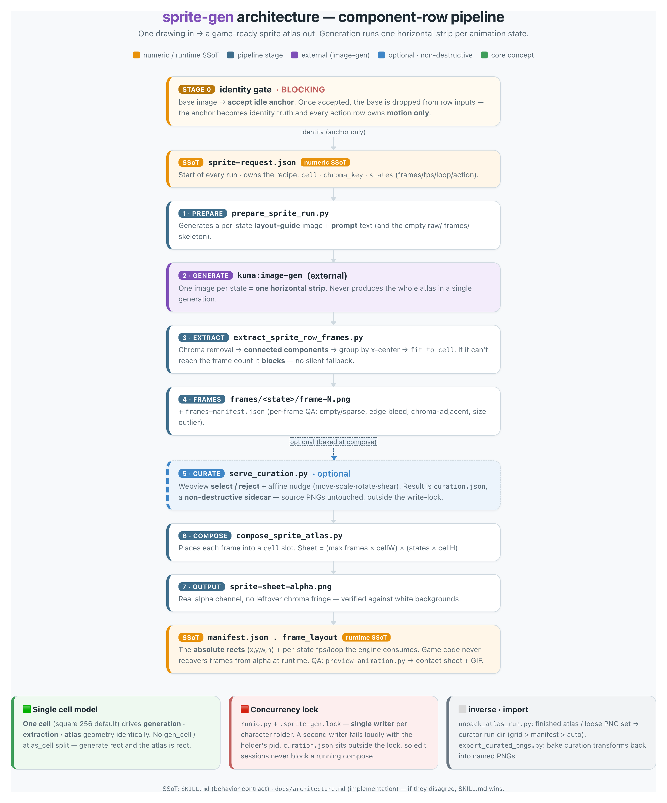

<p align="center">
  
  
  
  
  
  
  
</p>

<h1 align="center">sprite-gen</h1>

<p align="center"><b>Un solo dibujo de entrada. Un atlas de sprites listo para juegos de salida.</b></p>

<p align="center">

**Inglés** · [한국어](README.ko.md) · [日本語](README.ja.md) · [简体中文](README.zh-Hans.md) · [Español](README.es.md) · [Français](README.fr.md)

</p>

---

Pides a un modelo de imagen una “sprite sheet” y sabes lo que obtienes: un personaje cuya cara cambia en cada fotograma, un fondo que no se puede eliminar con chroma, poses que se superponen y se salen de la cuadrícula, y un PNG que el motor de tu juego realmente no puede usar. Un demo tierno, un recurso inútil.

`sprite-gen` es una skill de Codex/Claude que cierra esa brecha. Dale **una imagen base** y una lista de acciones —genera fila por fila, fija la identidad del personaje, elimina el fondo cromático a alpha real, extrae cada pose como un fotograma transparente limpio y hornea un atlas en tiempo de ejecución **con un `manifest.json.frame_layout` legible por máquina**. Todos los sprites anteriores se hicieron así.

Y para ese 10 % final que la generación nunca acierta, existe una **webview de curación**: compara fotogramas lado a lado, descarta los rotos, ajusta rotación/escala/posición de forma no destructiva, mira el bucle en vivo y luego hornea. La canalización hace el trabajo pesado; tú conservas la intención.

```text
sprite-request.json → guías de layout + prompts → filas de estado de image-gen
→ alpha por chroma → componentes conectados → fotogramas transparentes
→ sprite-sheet-alpha.png + manifest.json.frame_layout
```

<p align="center">
  
</p>

> Arquitectura completa: [`docs/architecture.md`](docs/architecture.md) · fuente del diagrama: [`docs/architecture-diagram.html`](docs/architecture-diagram.html)

## Lo que realmente obtienes

- **Un atlas de sprites transparente** (`sprite-sheet-alpha.png`) — alpha real, sin borde de chroma residual, verificado sobre fondos blancos.
- **Un manifiesto en tiempo de ejecución** (`manifest.json.frame_layout`) — rectángulos de fotograma absolutos, fps por estado y banderas de loop. Tu motor usa esos rectángulos; nunca adivina una rejilla.
- **QA que puedes ver** — GIFs por estado y contact sheets, para juzgar el movimiento antes de enviar nada.
- **Etiquetas honestas** — acciones cortas y legibles (idle, jump, attack, wave) son el camino estable; la locomoción cíclica (walk/run) se marca como experimental salvo que la QA de movimiento la apruebe. Sin sobrepromesas silenciosas.

## Webview de curación

La generación te da un 90%. La webview es donde una persona convierte eso en *listo para envío* — independiente, sin dependencia de Studio ni de un framework, funciona dondequiera que la skill esté instalada (Claude Code Desktop, la app Codex, una terminal simple).


- **Dos filas por estado:** la **secuencia de reproducción** arriba y un **pool de candidatos** abajo (por ejemplo, una segunda o tercera toma generada). Arrastra el mango ⠿ de un fotograma para reordenar la secuencia, o toma un corte del pool para reconstruir un bucle limpio con los mejores fotogramas entre tomas. La disposición se guarda, así que al abrir de nuevo se restaura.
- **Transformación no destructiva** por fotograma: arrastrar = mover, rueda = escalar, asa superior = rotar, inferior izquierda = cizallar, además de un conmutador de volteo horizontal para salida espejada izquierda-derecha. Las ediciones viven en un sidecar `curation.json`; los PNG originales nunca se reescriben, y el paso de composición hornea el resultado de forma determinista. La vista previa y el horneado comparten una sola matriz afín, así que lo que alineas es lo que obtienes.
- **Vista previa en vivo** anima la secuencia al fps del estado, con play/pausa, avance fotograma a fotograma y control de velocidad de 0.25×–4×.
- No es solo para sprites: apúntalo a cualquier carpeta de candidatos de imagen (íconos, logotipos, borradores generados) con `unpack_atlas_run.py --pngs-dir` y úsalo como vista general para elegir ganador.

### Cuadrícula de suelo isométrico

Para sets isométricos, la webview superpone la cuadrícula del suelo (de `meta.json` tile/anchor) para que puedas acoplar muebles a los ejes en diamante con el control de cizalla.


### Idiomas

La webview se distribuye en inglés y coreano. Pasa `--lang en|ko` al iniciar, o usa el selector interno:

```bash
python3 scripts/serve_curation.py --run-dir <run-dir> --lang en   # o ko
```

## Compatibilidad de Python

`sprite-gen` soporta CPython 3.10+. La CI ejecuta la versión mínima soportada (3.10) y la última version cubierta (3.14) en runners alojados por GitHub.

La guía rápida requiere una instalación de Python con `venv`/`ensurepip` funcionando. Si `python3 -m venv` falla antes de la instalación de paquetes en una distribución local, usa una build estándar de CPython para cualquier versión soportada y vuelve a ejecutar los mismos comandos.

## Inicio rápido

```bash
# 0. instalar dependencias (Pillow) en un virtualenv nuevo
python3 -m venv .venv && source .venv/bin/activate
pip install -e .

# 1. preparar una corrida desde una imagen base
python3 scripts/prepare_sprite_run.py --out-dir <run-dir> --character-id <id> --base-image base.png

# 2. generar una imagen por fila y estado con image-gen, guardar como raw/<state>.png
# 3. extraer fotogramas
python3 scripts/extract_sprite_row_frames.py --run-dir <run-dir>

# 4. (opcional) curar fotogramas en la webview
python3 scripts/serve_curation.py --run-dir <run-dir>

# 5. hornear el atlas en tiempo de ejecución
python3 scripts/compose_sprite_atlas.py --run-dir <run-dir>
```

### Editar una hoja terminada

Cuando solo sobrevive la hoja combinada, reconstruye un run dir listo para curación, luego haz curación y exporta:

```bash
# reconstruir fotogramas: --grid explícito, rectángulos de --manifest, o detección automática de alpha (predeterminado)
python3 scripts/unpack_atlas_run.py --atlas sheet.png            # auto-detect
python3 scripts/unpack_atlas_run.py --manifest manifest.json     # rectángulos exactos
python3 scripts/unpack_atlas_run.py --pngs-dir furniture/        # importar un conjunto suelto de PNG

# después de curar, hornea las correcciones en PNGs nombrados
python3 scripts/export_curated_pngs.py --run-dir <run-dir>
```

El resultado por defecto es una carpeta `<source>-curator` fácil de encontrar junto a la entrada.

El flujo de trabajo completo orientado a agentes y los contratos están en [`SKILL.md`](SKILL.md).

## Instalación

Desde los flujos de instalación de skills de Codex, instala este repositorio como una skill raíz:

```bash
python3 ~/.codex/skills/.system/skill-installer/scripts/install-skill-from-github.py \
  --repo aldegad/sprite-gen --path .
```

## Atribución

El flujo de trabajo por fila de componentes está inspirado por la skill `hatch-pet` con licencia Apache-2.0, pero apunta a atlases de sprites de juego genéricos y no incluye paquetes de mascotas ni assets visuales de mascotas.

## Licencia

Apache-2.0